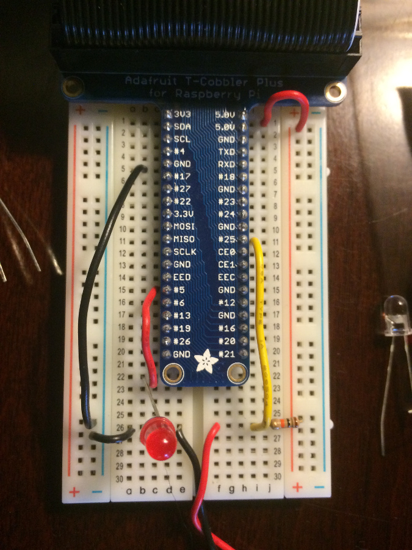

# pitooth-fsr

A stack which allows a force-sensitive resistor connected to a Raspberry Pi to act as a Bluetooth keyboard and send keystrokes when the resistor is depressed.

## Compiling & Installing Dependencies

### btkbdd

    cd btkbdd
    make
    sudo cp btkbdd /usr/local/bin

### keystroke

    g++ -o keystroke keystroke.c
    sudo cp keystroke /usr/local/bin

## Wiring

## Running

Start the Bluetooth keyboard daemon:

    sudo btkbdd /dev/input/event0 -d

Start the FSR listener:

    sudo ./fsr.py
